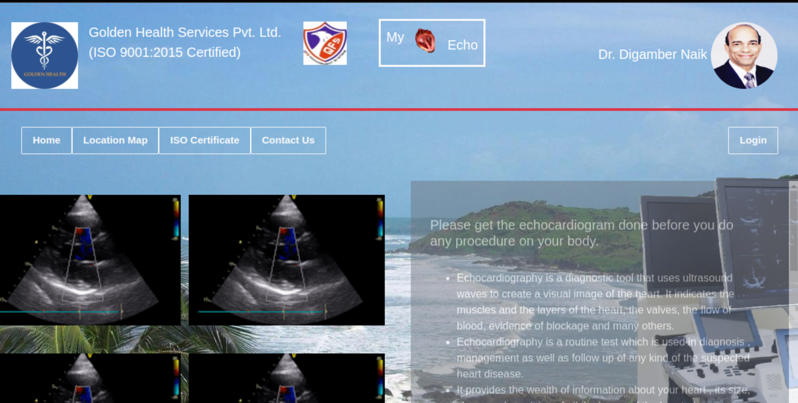

# Clinic-Management-System

#### Golden Health Services Pvt Ltd

---

# Clinic-Management-System

### **Overview**
The Clinic Management System (CMS) is a full-stack web application designed to streamline clinic operations. It includes:
- A **frontend** built with Angular for managing user interactions and displaying data.
- A **backend** built with Node.js for handling API requests, authentication, and database operations.

This system is modular and scalable, making it suitable for small to medium-sized clinics.

---

### **Angular Files**
- Configuration and project files:
  - `.editorconfig`, `.gitignore`, `.vscode/`
  - `angular.json`, `browserslist`, `karma.conf.js`
  - `tsconfig.*.json`, `tslint.json`
- App-specific code:
  - `src/`: Main application source folder
- Dependencies:
  - `package.json`, `package-lock.json`
- Documentation:
  - `README.md`, 

---

### **Node.js Files**
- Core files:
  - `index.js`, `server.js`
- Configuration:
  - `.env`, `package.json`, `package-lock.json`
- App folder:
  - `server/`
- Documentation:
  - `README.md`

---

## **Features**

1. **Patient Management**:
   - Add, update, or remove patient records.
   - View appointment history and medical records.

2. **Appointment Scheduling**:
   - Book, reschedule, or cancel appointments.
   - Integrated calendar view for clinic operations.

3. **Staff Management**:
   - Add and manage staff details.
   - Role-based access control.

4. **Medical Records**:
   - Securely store and retrieve patient medical data.

---

## **Technologies Used**
- **Frontend**: Angular
- **Backend**: Node.js with Express.js
- **Database**: MySQL

---

## **Getting Started**

### **1. Prerequisites**
- Node.js (v14 or later)
- Angular CLI (v9.1.9 or later)
- [Database software]

### **2. Installation**

This project was generated with [Angular CLI](https://github.com/angular/angular-cli) version 9.1.9.

### Development server

Run `ng serve` for a dev server. Navigate to `http://localhost:4200/`. The app will automatically reload if you change any of the source files.

### Code scaffolding

Run `ng generate component component-name` to generate a new component. You can also use `ng generate directive|pipe|service|class|guard|interface|enum|module`.

### Build

Run `ng build` to build the project. The build artifacts will be stored in the `dist/` directory. Use the `--prod` flag for a production build.

### Running unit tests

Run `ng test` to execute the unit tests via [Karma](https://karma-runner.github.io).

### Running end-to-end tests

Run `ng e2e` to execute the end-to-end tests via [Protractor](http://www.protractortest.org/).

### Further help

To get more help on the Angular CLI use `ng help` or go check out the [Angular CLI README](https://github.com/angular/angular-cli/blob/master/README.md).

---

